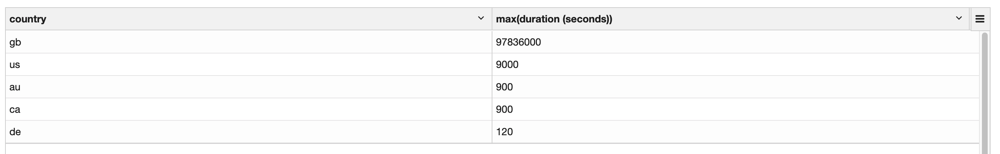
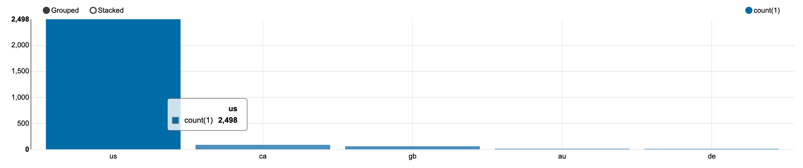
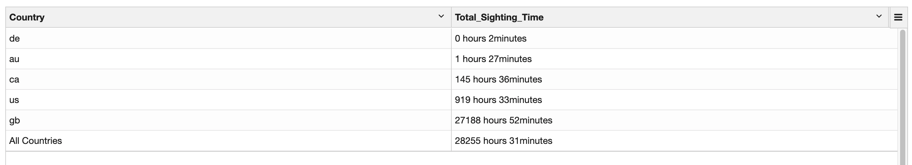
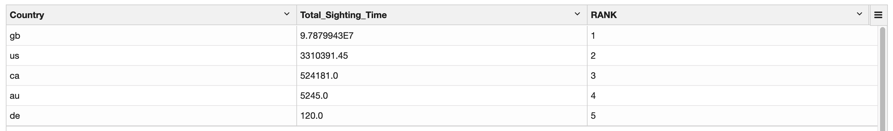

# **UFO 관측 dataset을 분석하기 위한 데이터 파이프라인 구축**

## **Overview**

이번 프로젝트에서는 Kappa Architecture를 구성하여 UFO 관측 데이터셋을 S3에 저장을 하여 DL(Data Lake)를 구축하고, 적제된 Raw 데이터를 Amazon EMR에서 Zepplin을 통해 Spark SQL을 활용하여 데이터를 정제하여 DW, DM 레벨의 데이터를 만들고, S3에 적제하여 활용도 있는 데이터를 만들어내는 것이 목표입니다.

 

## **Data Architecture**

이 데이터 아키텍처를 선택한 이유는 현대에 와서는 컴퓨터 리소스와 컴퓨팅 기술, 스트림처리 엔진에 대한 기술의 발달로 배치와 스트림 처리를 모두 실시간 스트림으로 처리하는 것이 가능해졌기 때문에 `Kappa Architecture`를 선택하였습니다.

분석하고자 하는 UFO 관측 데이터셋(CSV)을 파이썬 스크립트를 통해 객체 리스트로 변환을 한 후에 만들어진 객체 리스트를 순회하면서 `API Gateway` End Point로 객체 하나씩 전송하도록 처리를 하였습니다. API Gateway End Point로 전송된 데이터는 `Kinesis Data streams`으로 전송이 되고, 최종적으로 `Kinesis Data Firehose`를 통해 `S3`에 Raw 데이터로써 적재가 되고, 이로써 DL(Data Lake)를 구성을 하였습니다. (`80332개의 데이터가 전송되도록 구성`)

적재된 Raw 데이터는 Amazon EMR에서 Zepplin을 통해 Spark Interpreter를 사용하여 PySpark를 활용하여 데이터를 정제하고, 최종적으로 DW(Silver)와 DM(Gold) 데이터로써 S3에 적재를 하였습니다. 그리고 Zepplin에서 데이터를 그래프로 시각화하는 기능을 제공하기 때문에 이를 활용하여 데이터들간의 관계를 시각적으로 확인할 수 있었습니다. 

 

## **Data Transformation & Visualization**

PySpark, SparkSQL을 활용하여 Raw 데이터를 정제하였습니다.

<table>
    <tr>
        <th style="text-align:center">NO</th>
        <th style="text-align:center">Image</th>
        <th style="text-align:center">Description</th>
    </tr>
    <tr>
        <td>1</td>
        <td>
            
        </td>
        <td>각 국가코드를 기준으로 그룹화하고, 각 국가별 UFO 최대 관측시간을 구해서 최대 관측시간을 기준으로 내림차순으로 정렬</td>
    </tr>
    <tr>
        <td>2</td>
        <td>
            
        </td>
        <td>각 국가별 UFO 관측 횟수를 기준으로 내림차순으로 정렬하고, Zepplin에서 막대 그래프로 시각화 처리</td>
    </tr>
    <tr>
        <td>3</td>
        <td>
            
        </td>
        <td>국가별 UFO 관측시간의 총합을 구하고, 모든 국가의 UFO 관측시간 총합을 출력</td>
    </tr>
    <tr>
        <td>4</td>
        <td>
            
        </td>
        <td>국가별 관측시간의 총합을 기준으로 순위를 출력(별도의 칼럼으로 순위정보 출력)</td>
    </tr>
</table>

 

## **Prerequisites**
프로젝트에서 사용된 데이터 파이프라인의 각 컴포넌트는 AWS의 서비스들을 활용하였습니다. 

- AWS 계정을 준비
- 코드를 실행할 IDE (VSCODE, Sublime Text 등)
- 로컬에 분석에서 사용할 Dataset 복사

 

## **How to Run This Project**

본 프로젝트의 데이터 파이프라인 구축 및 데이터 수집/적재/분석을 위해서 아래의 순서에 따라 실행해주세요.

1. 준비한 AWS 계정에서 access key와 secret key를 생성하고, 해당 정보를 terraform 폴더 하위의 terraform.tf 파일의 `aws_access_key`, `aws_secret_key`의 default 속성의 값으로 넣어주세요. (aws_region은 seoul region의 경우, "ap-northeast-2"로, 그 외의 지역은 선택적으로 넣어주세요)

2. Terminal에서 프로젝트의 Infrastructure 폴더로 위치한 상태에서 `Terraform apply --auto-approve` 명령을 실행합니다.

3. AWS 웹 페이지에서 API Gateway, Kinesis data stream, Kinesis data firehose, S3의 hg-project-stream-event-backup 버킷이 생성이 되었는지 확인을 합니다. 

4. 제대로 생성이 되었다면, 이제 API Gateway의 End point url을 확인하기 위해 해당 서비스로 이동해서 [Stages]-"production"-"/" 하위의 /v1의 POST를 클릭하여 Invoke URL 주소를 확인합니다. 

5. 확인된 API Gateway의 End point url을 복사하여 프로젝트의 `data-generator`폴더 하위의 `data-generator.py` 파일의 32번째 줄 [API Gateway End Point] 부분에 붙여넣습니다.

6. 이제 Terminal에서 프로젝트의 data-generator 폴더로 이동한 후에 `python3 data-generator.py`명령을 실행하여 API Gateway로 csv 파일의 각 행의 데이터를 객체화 시켜서 JSON 포멧으로 만든 다음에 전송을 하도록 합니다. (80332개 데이터 전송) 

7. 

## Lessons Learned

It's good to reflect on what you learned throughout the process of building this project. Here you might discuss what you would have done differently if you had more time/money/data. Did you end up choosing the right tools or would you try something else next time?

## Contact

Please feel free to contact me if you have any questions at: LinkedIn, Twitter
