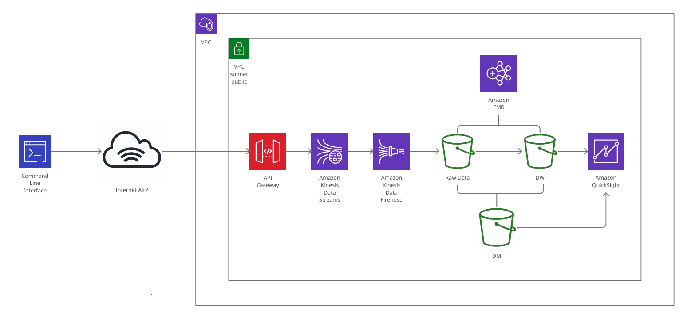

# **UFO 관측 dataset을 분석하기 위한 데이터 파이프라인 구축**

## **Overview**

이번 프로젝트에서는 데이터 파이프라인을 Kappa Architecture로 구성합니다. UFO 관측 데이터셋을 S3에 저장하여 DL(Data Lake)를 구축하고, 적재된 Raw 데이터를 Amazon EMR에서 Zepplin을 통해 Spark SQL을 활용하여 데이터를 정제합니다. (`DW, DM 레벨의 데이터를 생성 후 S3에 적재`) 그리고 S3에 저장된 데이터는 `Amazon QuickSight를 활용하여 분석 및 시각화`를 하게 됩니다.

 

## **Dataset**

프로젝트에서 사용할 데이터는 Kaggle에서 제공하는 UFO Sighting CSV 포멧의 데이터셋을 활용했습니다. 해당 데이터셋을 선택한 이유는 최근 뉴스에서 미국 의회가 UFO에 대한 공개 청문회를 50년만에 개최하였고, UFO의 존재에 대해 인정을 하였기 때문에 흥미로운 데이터셋이 없을까 고민하던 중 선택하게 되었습니다.

**ref. Kaggle (UFO Sighting)** : [https://www.kaggle.com/datasets/NUFORC/ufo-sightings](https://www.kaggle.com/datasets/NUFORC/ufo-sightings)

 

## **Objective**

이번 프로젝트를 통해 주어진 데이터셋을 분석하여 아래의 내용들과의 상관관계에 대해서 알아볼 것입니다.

- 국내에서 UFO가 발견된 시기와 장소에 대한 정보
- UFO 목격 가능성이 가장 높은 지역
- UFO가 특정 계절에 많이 목격되는지
- 가장 일반적으로 묘사되는 UFO에 대한 설명

 

## **Data Architecture**

이 데이터 아키텍처를 선택한 이유는 현대에 와서는 컴퓨터 리소스와 컴퓨팅 기술, 스트림처리 엔진에 대한 기술의 발달로 배치와 스트림 처리를 모두 실시간 스트림으로 처리하는 것이 가능해졌기 때문에 `Kappa Architecture`를 선택하였습니다.

과거와 달리 스트림처리 엔진이 at-most-once가 아닌, `exactly-once까지 지원`을 하면서 전달되는 데이터를 보장하고, 메시지의 유실 가능성 및 중복 가능성도 없어지면서 스트림 처리를 통한 신뢰도가 높아졌습니다.

분석하고자 하는 UFO 관측 데이터셋(CSV)을 파이썬 스크립트를 통해 객체 리스트로 변환을 한 후에 만들어진 객체 리스트를 순회하면서 `API Gateway` End Point로 JSON 포멧의 데이터로써 객체 하나씩 전송하도록 처리를 하였습니다. API Gateway End Point로 전송된 데이터는 `Kinesis Data streams`으로 전송이 되고, 최종적으로 `Kinesis Data Firehose`를 통해 `S3`에 Raw 데이터로써 적재를 하고, 이로써 DL(Data Lake)를 구성하도록 하였습니다. (`80332개의 데이터`)

적재된 Raw 데이터는 Amazon EMR에서 Zepplin을 통해 Spark Interpreter를 사용하여 PySpark를 활용하여 데이터를 정제하고, 최종적으로 DW(Silver)와 DM(Gold) 데이터로써 S3에 적재를 하였습니다. 그리고 S3에 적재된 데이터는 Amazon QuickSight를 활용하여 데이터들간의 관계를 시각적으로 확인할 수 있도록 하였습니다.

- ### **Better Architecture**

    이번 프로젝트에서 HDFS를 S3로 대체해서 사용한 이유는 Data node(S3)와 Computing node(EMR)을 서로 분리하여 독립적인 객체로써 운영함으로써 좋은 Data pipeline Architecture를 구성할 수 있을 것이라고 생각했기 때문입니다.
    지금은 작은 규모의 사이드 프로젝트이지만, 향후에 복수 작업자 간에 Storage의 데이터를 Spark를 활용해서 동시 접근 및 처리하는 형태로 업무를 해야되는 경우가 생길 수 있기 때문에 Data node와 Computing node를 분리함으로써 각 각의 작업자들 간의 종속성 분리를 통해 좀 더 나은 Data Pipeline Architecture를 만들 수 있지 않을까 생각되어 구성해보았습니다. 

 

## **Data Transformation & Visualization**

PySpark, SparkSQL을 활용하여 Raw 데이터를 정제한 후에 Amazon QuickSight를 통해 DM의 데이터를 시각화하여 처리해보았습니다. Amazon QuickSight는 Amazon에서 제공되는 Cloud native serverless BI 툴로써, AWS 계정 없이 데이터를 기반으로 시각화한 Dashboard를 생성하고 공유할 수 있습니다. 이러한 장점으로 향후에 업무에서 AWS S3에 적재된 데이터를 시각화하여 처리할때 유용하게 사용될 것 같아 Amazon QuickSight를 선택하였습니다. 

<table>
    <tr>
        <th style="text-align:center">NO</th>
        <th style="text-align:center">Image</th>
        <th style="text-align:center">Description</th>
    </tr>
    <tr>
        <td>1</td>
        <td>
            
        </td>
        <td>각 국가코드를 기준으로 그룹화하고, 각 국가별 UFO 최대 관측시간을 구해서 최대 관측시간을 기준으로 내림차순으로 정렬</td>
    </tr>
    <tr>
        <td>2</td>
        <td>
            
        </td>
        <td>각 국가별 UFO 관측 횟수를 기준으로 내림차순으로 정렬하고, Zepplin에서 막대 그래프로 시각화 처리</td>
    </tr>
    <tr>
        <td>3</td>
        <td>
            
        </td>
        <td>국가별 UFO 관측시간의 총합을 구하고, 모든 국가의 UFO 관측시간 총합을 출력</td>
    </tr>
    <tr>
        <td>4</td>
        <td>
            
        </td>
        <td>국가별 관측시간의 총합을 기준으로 순위를 출력(별도의 칼럼으로 순위정보 출력)</td>
    </tr>
</table>

 

## **Prerequisites**
프로젝트에서 사용된 데이터 파이프라인의 각 컴포넌트는 AWS의 서비스들을 활용하였습니다. 

- AWS 계정을 준비
- 코드를 실행할 IDE (VSCODE, Sublime Text 등)
- 로컬에 분석에서 사용할 Dataset 복사

 

## **How to Run This Project**

본 프로젝트의 데이터 파이프라인 구축 및 데이터 수집/적재/분석을 위해서 아래의 순서에 따라 실행해주세요.

1. 준비한 AWS 계정에서 access key와 secret key를 생성하고, 해당 정보를 terraform 폴더 하위의 terraform.tf 파일의 `aws_access_key`, `aws_secret_key`의 default 속성의 값으로 넣어주세요. (aws_region은 seoul region의 경우, "ap-northeast-2"로, 그 외의 지역은 선택적으로 넣어주세요)

2. Terminal에서 프로젝트의 Infrastructure 폴더로 위치한 상태에서 `Terraform apply --auto-approve` 명령을 실행합니다.

3. AWS 웹 페이지에서 API Gateway, Kinesis data stream, Kinesis data firehose, S3의 hg-project-stream-event-backup 버킷이 생성이 되었는지 확인을 합니다. 

4. 제대로 생성이 되었다면, 이제 API Gateway의 End point url을 확인하기 위해 해당 서비스로 이동해서 [Stages]-"production"-"/" 하위의 /v1의 POST를 클릭하여 Invoke URL 주소를 확인합니다. 

5. 확인된 API Gateway의 End point url을 복사하여 프로젝트의 `data-generator`폴더 하위의 `data-generator.py` 파일의 32번째 줄 [API Gateway End Point] 부분에 붙여넣습니다.

6. 이제 Terminal에서 프로젝트의 data-generator 폴더로 이동한 후에 `python3 data-generator.py`명령을 실행하여 API Gateway로 csv 파일의 각 행의 데이터를 객체화 시켜서 JSON 포멧으로 만든 다음에 전송을 하도록 합니다. (80332개 데이터 전송) 

7. 

## Lessons Learned

이번 프로젝트를 통해서 AWS의 상용 서비스들의 활용에 대해서 좀 더 익숙해지는 계기가 되었고, 더 나아가 각 상용서비스가 기반으로 하고 있는 오픈 소스 프로젝트들에 대해서 더 찾아봄으로써 공부가 많이 되었습니다. 

실제로 기업에서 많은 데이터를 핸들링하는 경우에는 상용서비스를 이용하기 보다는 자체 서버를 구축하여 운영하는 경우가 많기 때문에 관리/운영적 측면에서 각 오픈소스 프로젝트들이 내부적으로 어떻게 동작을 하는지, 최적화를 시킬 수 있는 방법에 대해서 좀 더 학습을 해보았습니다. 

이번 데이터 파이프라인에서 사용한 Kinesis data stream의 경우에는 오픈소스 프로젝트인 Kafka와 같은 기능을 하는 AWS의 완전 관리형 서비스로, 한 번 shard 수를 늘리게 되면 줄일 수 없는 Kafka와 달리, Kinesis data stream에서는 shard 수를 유연하게 늘리고 줄일 수 있습니다. 좀 더 Partition, Replica의 수와 같은 값 설정을 통해 커스텀한 Kafka 서비스를 사용하고자 할때에는 Kafka를 자체 서버에서의 구축을 통해 사용하는 것이 좋다는 것 또한 배웠습니다. 

프로젝트를 진행하면서 DW와 DM의 구분 경계가 애매한 부분이 있어서 이 부분을 다른 프로젝트를 통해서 다른 파이프라인 구조로 개선을 해볼 예정입니다. 예를들면, 현재 Kinesis data stream의 데이터가 Kinesis data firehose를 통해서 S3에 적재가 되는데, Python 스크립트상에서 이미 JSON 포멧으로 데이터를 바로 말아주면서 던져주고 있기 때문에 별도의 DW의 가공을 통한 S3 적재 없이 Kinesis data stream으로부터 받은 데이터를 바로 Flink로 던져서 Flink와 연결된 ES(ElasticSearch)에서 시각화를 통한 데이터 분석을 하는 방식으로 수정을 해 볼 것입니다.

 

## Contact

Email : tireless.hyungi.lee@gmail.com
